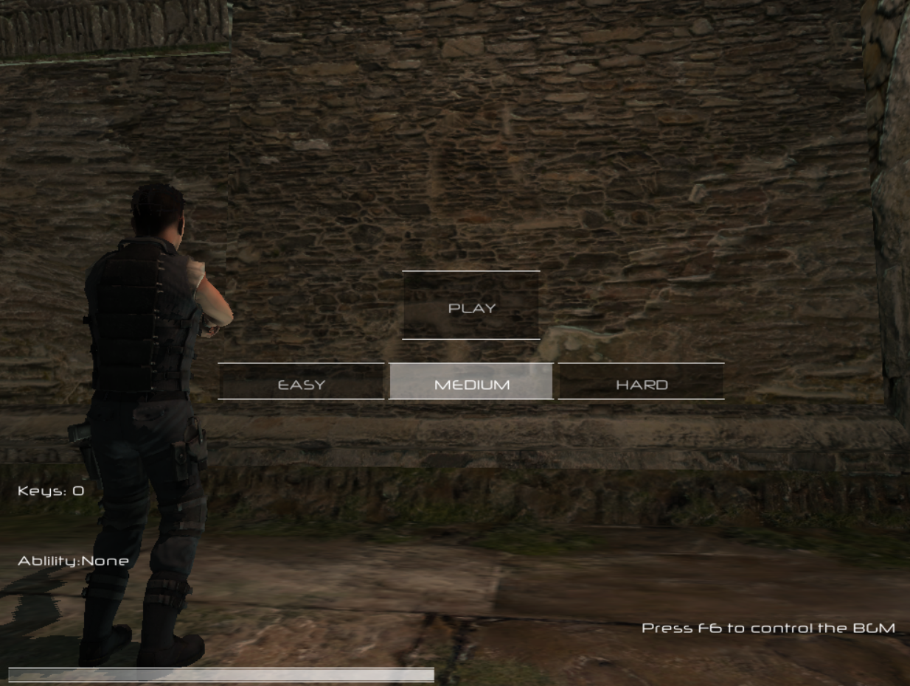
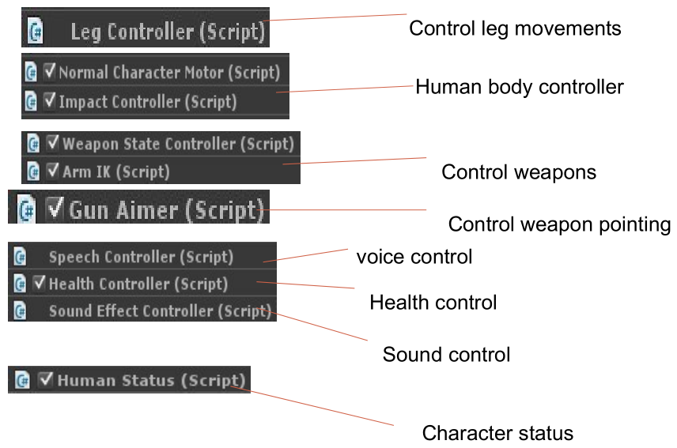
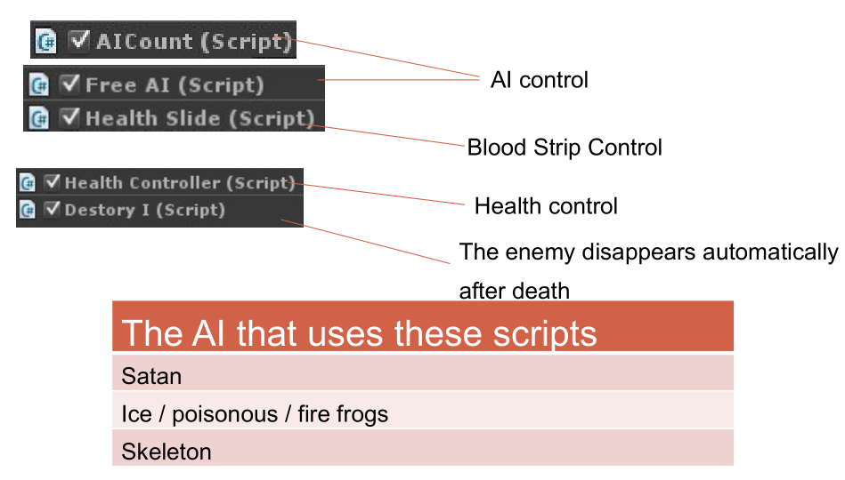
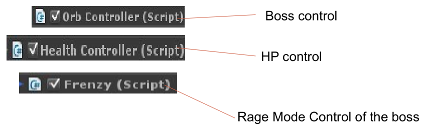
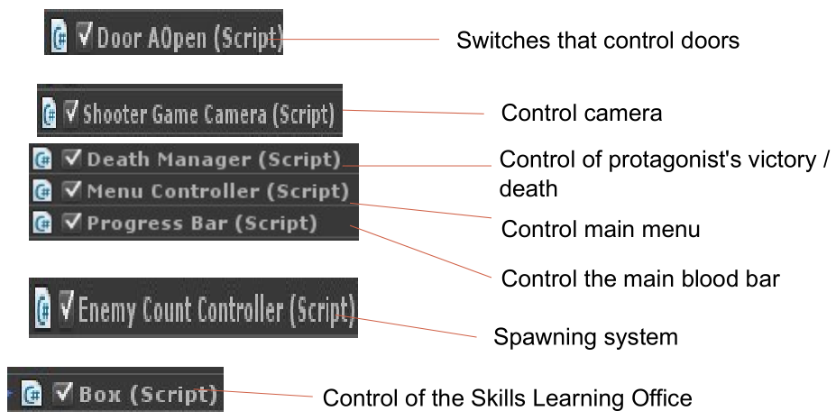

# CryptShoke
===============

A 3D TPS game developed on Unity3D;

    <b>Figure 1: Game main interface</b>
    

## Scenario ##

Our protagonist crosses into a crypt. Trolls and robots, ancient and future, are all mixed in this world. Faced with all sorts of enemies, how could he escape the maze with his gun? Let's see what he will get!

## Main codes ##

### Protagonist codes ###

### AI codes ###

### Boss AI codes ###

### Other codes ###

## Future work ##

1. The pause button can be set;
2. Set up more levels and switch between levels;
3. More skills and more items;
4. Program optimization.

## Download ##

Download available at <https://github.com/george-chou/CryptShoke/releases>;

Running game body may require `DirectX`, shortcut: [dxwebsetup.exe](https://download.microsoft.com/download/1/7/1/1718CCC4-6315-4D8E-9543-8E28A4E18C4C/dxwebsetup.exe).

